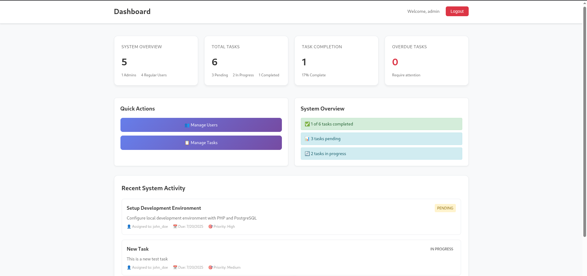
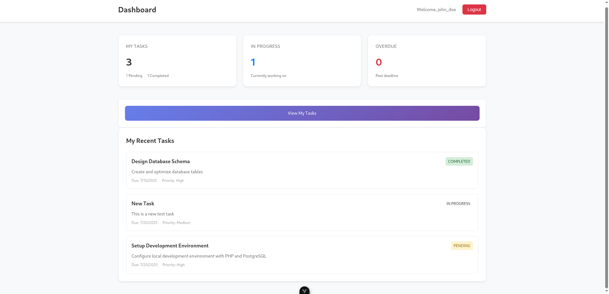
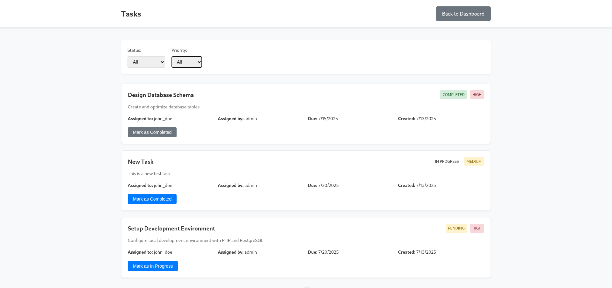
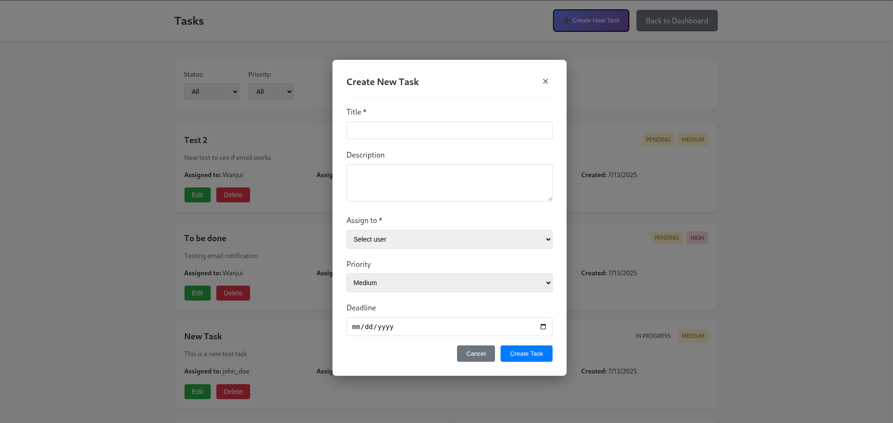
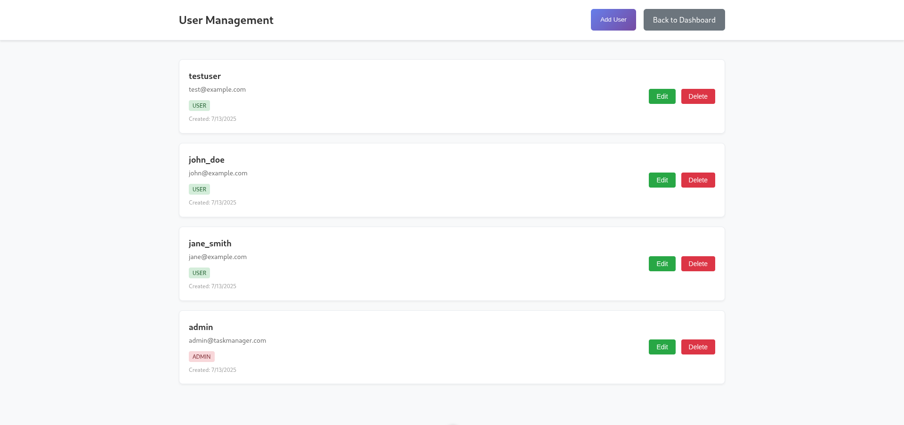
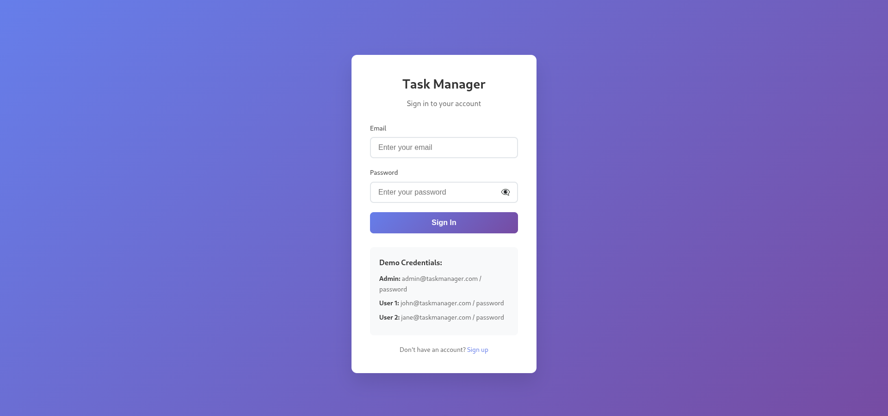
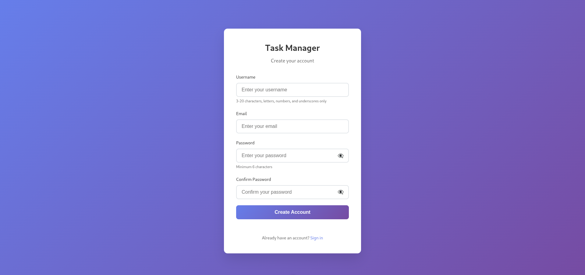

# Task Management System

A modern, full-stack task management application built with PHP backend and Vue.js frontend, featuring real-time email notifications and comprehensive user management.

## 📋 Project Overview

This task management system allows administrators to manage users, assign tasks, and track progress while providing users with the ability to view and update their assigned tasks. The system includes email notifications for task assignments and a beautiful, responsive dashboard.

## 🎯 Requirements vs Deliverables

### ✅ **Core Requirements (All Completed)**

| Requirement | Status | Implementation |
|-------------|--------|----------------|
| **Admin User Management** | ✅ Complete | Full CRUD operations for users with role-based access |
| **Task Assignment** | ✅ Complete | Admin can assign tasks to users with deadlines |
| **Task Status Management** | ✅ Complete | Pending → In Progress → Completed workflow |
| **User Task Viewing** | ✅ Complete | Users can view tasks assigned to them |
| **Task Status Updates** | ✅ Complete | Users can update their task status |
| **Email Notifications** | ✅ Complete | SMTP-based email notifications for task assignments |

### 🚀 **Additional Features Delivered**

| Feature | Description |
|---------|-------------|
| **Modern Dashboard** | Comprehensive admin and user dashboards with statistics |
| **Real-time Updates** | Instant UI updates when task status changes |
| **Advanced Filtering** | Filter tasks by status, priority, and date |
| **Professional UI/UX** | Beautiful, responsive design with animations |
| **Email Templates** | Professional HTML email templates |
| **Type Safety** | Full TypeScript implementation |
| **OOP Architecture** | Well-structured PHP classes and Vue components |

## 🏗️ Architecture

```
cytonn/
├── api/                    # PHP Backend (Port 8000)
│   ├── classes/           # OOP Classes (User, Task, Database, EmailService)
│   ├── config/           # Configuration files
│   ├── database/         # PostgreSQL schema
│   └── index.php         # Main API router
├── public/               # Vue.js Frontend (Port 5173)
│   ├── src/
│   │   ├── views/       # Vue Components (Dashboard, Tasks, Users, Auth)
│   │   ├── stores/      # Pinia state management
│   │   └── router/      # Vue Router navigation
│   └── package.json
└── database/
    └── task-management.sql  # PostgreSQL schema dump
```

## 🛠️ Technology Stack

### **Backend**
- **PHP 8.4** - Core backend language
- **PostgreSQL** - Relational database
- **PHPMailer** - Email sending library
- **OOP Architecture** - Well-structured classes

### **Frontend**
- **Vue.js 3** - Progressive JavaScript framework
- **TypeScript** - Type safety and better development experience
- **Pinia** - State management
- **Vue Router** - Client-side routing
- **Vite** - Build tool and dev server

### **Infrastructure**
- **RESTful API** - Clean API design
- **CORS Support** - Cross-origin resource sharing
- **Session Management** - Secure authentication
- **SMTP Integration** - Gmail SMTP for emails

## 📸 UI Screenshots

### Dashboard Views

*Admin dashboard showing system statistics, user management, and task overview*


*User dashboard displaying personal task statistics and recent assignments*

### Task Management

*Task management interface with filtering and status updates*


*Task creation modal with assignment and deadline options*

### User Management

*Admin interface for managing users, roles, and permissions*

### Authentication

*Modern login interface with form validation*


*User registration with validation and role assignment*

## 🚀 Getting Started

### Prerequisites
- PHP 8.0+
- Node.js 16+
- PostgreSQL 12+
- Composer
- npm

### Backend Setup

1. **Clone the repository**
   ```bash
   git clone https://github.com/wanjuifavour/Task-Management.git
   cd Task-Management
   ```

2. **Configure the API**
   ```bash
   cd api
   cp config.env.example .env
   # Edit .env with your database and email settings
   ```

3. **Install dependencies**
   ```bash
   composer install
   ```

4. **Set up the database**
   ```bash
   # Create PostgreSQL database
   createdb task_management
   
   # Import schema
   psql -U postgres -d task_management -f database/task-management.sql
   ```

5. **Start the API server**
   ```bash
   php -S localhost:8000
   ```

### Frontend Setup

1. **Navigate to frontend directory**
   ```bash
   cd public
   ```

2. **Install dependencies**
   ```bash
   npm install
   ```

3. **Start the development server**
   ```bash
   npm run dev
   ```

4. **Access the application**
   - Frontend: http://localhost:5173
   - Backend API: http://localhost:8000

## 🔐 Default Credentials

- **Admin**: `admin@taskmanager.com` / `password`
- **Test Users**: Created during database setup

## 📧 Email Configuration

The system uses Gmail SMTP for email notifications. Configure in `api/.env`:

```env
SMTP_HOST=smtp.gmail.com
SMTP_PORT=587
SMTP_USERNAME=your-email@gmail.com
SMTP_PASSWORD=your-app-password
```

## 🗄️ Database Schema

### Users Table
```sql
CREATE TABLE users (
    id SERIAL PRIMARY KEY,
    username VARCHAR(50) UNIQUE NOT NULL,
    email VARCHAR(100) UNIQUE NOT NULL,
    password VARCHAR(255) NOT NULL,
    role VARCHAR(20) DEFAULT 'user',
    created_at TIMESTAMP DEFAULT CURRENT_TIMESTAMP,
    updated_at TIMESTAMP DEFAULT CURRENT_TIMESTAMP
);
```

### Tasks Table
```sql
CREATE TABLE tasks (
    id SERIAL PRIMARY KEY,
    title VARCHAR(200) NOT NULL,
    description TEXT,
    assigned_to INTEGER REFERENCES users(id),
    assigned_by INTEGER REFERENCES users(id),
    status VARCHAR(20) DEFAULT 'Pending',
    priority VARCHAR(20) DEFAULT 'Medium',
    deadline DATE,
    created_at TIMESTAMP DEFAULT CURRENT_TIMESTAMP,
    updated_at TIMESTAMP DEFAULT CURRENT_TIMESTAMP
);
```

## 🔌 API Endpoints

### Authentication
- `POST /api/auth` - Login, register, logout
- `GET /api/auth` - Check authentication status

### Users
- `GET /api/users` - Get all users (admin only)
- `POST /api/users` - Create user (admin only)
- `PUT /api/users/{id}` - Update user (admin only)
- `DELETE /api/users/{id}` - Delete user (admin only)

### Tasks
- `GET /api/tasks` - Get tasks (filtered by user role)
- `POST /api/tasks` - Create task (admin only)
- `PUT /api/tasks/{id}` - Update task status
- `DELETE /api/tasks/{id}` - Delete task (admin only)

### Dashboard
- `GET /api/dashboard` - Get dashboard statistics

## 🎨 Features

### **Admin Features**
- ✅ User management (CRUD operations)
- ✅ Task assignment with deadlines
- ✅ System-wide statistics
- ✅ Email notifications for task assignments
- ✅ Task filtering and search

### **User Features**
- ✅ View assigned tasks
- ✅ Update task status
- ✅ Personal dashboard
- ✅ Email notifications

### **System Features**
- ✅ Role-based access control
- ✅ Session management
- ✅ Input validation
- ✅ Error handling
- ✅ Responsive design

## 🧪 Testing

### Backend Testing
```bash
cd api
php test.php          # Basic functionality test
php debug.php         # Database and service tests
php test-email.php    # Email configuration test
```

## 📦 Deployment

### Backend Deployment
- **Railway**: Easy deployment with PostgreSQL
- **Heroku**: Platform-as-a-Service
- **DigitalOcean**: VPS deployment
- **AWS**: Scalable cloud infrastructure

### Frontend Deployment
- **Vercel**: Optimized for Vue.js
- **Netlify**: Static site hosting
- **GitHub Pages**: Free hosting

## 🔧 Configuration

### Backend Environment Variables
```env
# Database
DB_HOST=localhost
DB_PORT=5432
DB_USERNAME=postgres
DB_PASSWORD=your_password
DB_DATABASE=task_management

# Email (Gmail SMTP)
MAIL_FROM=your-email@gmail.com
MAIL_FROM_NAME=Task Manager
SMTP_HOST=smtp.gmail.com
SMTP_PORT=587
SMTP_USERNAME=your-email@gmail.com
SMTP_PASSWORD=your-app-password

# Application
APP_ENV=production
APP_DEBUG=false
```

## 🤝 Contributing

1. Fork the repository
2. Create a feature branch
3. Make your changes
4. Add tests if applicable
5. Submit a pull request

## 📄 License

This project is licensed under the MIT License - see the LICENSE file for details.

## 🙏 Acknowledgments

- **Vue.js** - Progressive JavaScript framework
- **PHPMailer** - Email sending library
- **PostgreSQL** - Reliable database system
- **Vite** - Fast build tool

## 📞 Support

For support or questions:
- Create an issue in the repository
- Contact: [wanjui.dev@gmail.com]

---

**Built with love using modern web technologies** 